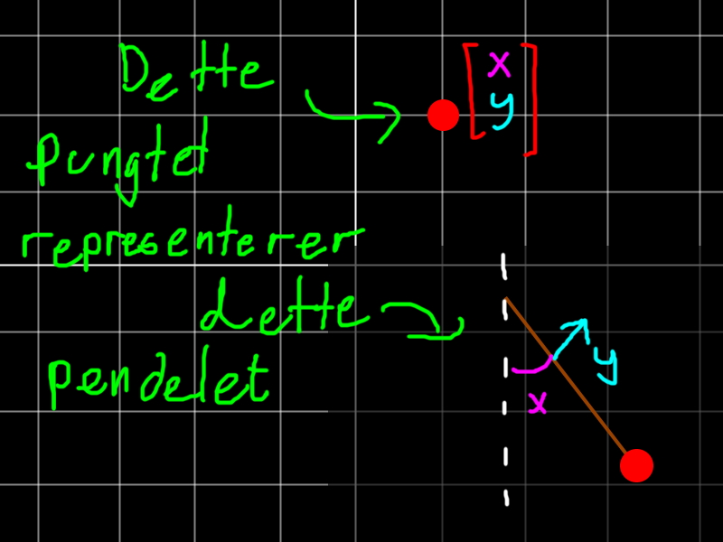

# Flow Field

Dette python-programmet har som mål å gi brukeren en bedre forståelese av hvordan et pendel fungerer.

Hvert pungt på skjermen representerer en situasjon. X representerer vinkelen pendelet lager med en vertikal linje, mens y posisjonen representerer hvor fort denne vinkelen endrer seg (hastigheten til pendelet).

(0, 0) ligger midt i skjermen

Det blir simulert 70 pendeler om gangen. disse beveger seg på skjermen som hvite striper. Disse hvite stripene ser ut som en væske som beveger seg, som er hvorfor dette kalles for et flow-field

Funskjonen som definerer denne bevegelsen er:

Hvor v er hastighetsvektoren, x er vinkelen til pendelet og y er hastigheten til pendelet. Funskjonen beskriver altså diff-ligningen til et pendel